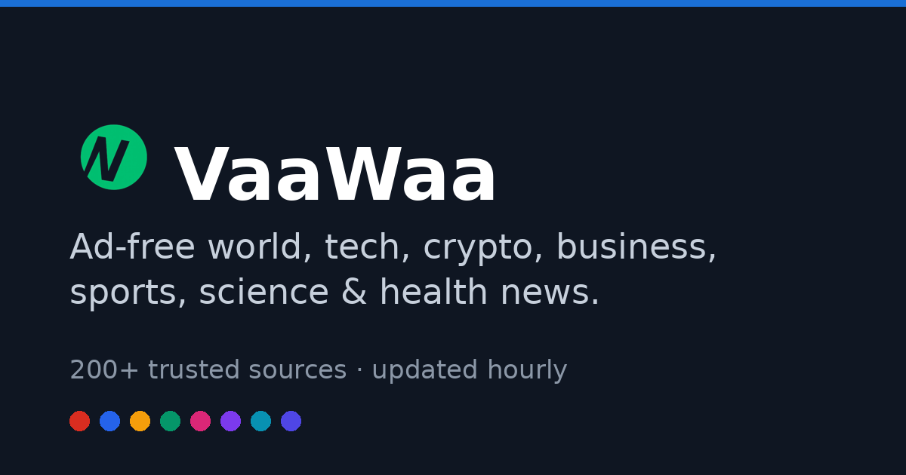

<h1 align="center">VaaWaa</h1>

<i>Ad-free world, tech, crypto, business, sports, science & health news.</i>

  
  

## About

VaaWaa is an ad-free world-news aggregator I built on a custom PHP stack. It pulls from 200+ trusted sources through an hourly RSS pipeline and organises everything into per-country and per-category feeds, with a clean, fast, distraction-free reading experience.

## Key features

- **200+ trusted sources** — aggregated and de-duplicated into clean feeds
- **Hourly refresh** — a scheduled pipeline keeps the front page current
- **Per-country & per-category pages** — world, tech, crypto, business, sports, science, health
- **Ad-free reading** — fast pages, no clutter
- **Custom RSS engine** — resilient parsing across inconsistent publisher feeds

## Built with

    

## Pipeline and evidence boundary

The documented flow is publisher RSS → scheduled ingestion → normalization/deduplication → country/category feeds → reading pages. RSS items are external data: attribution, timestamp interpretation, malformed feeds and repeated headlines are the main boundaries to explain.

Useful acceptance checks are: identical stories do not multiply on repeated imports; failed feeds retain prior usable data; one broken publisher does not block the entire refresh; and displayed freshness reflects the last successful import. These checks describe the intended quality bar, not a test result from private source.

This repository contains documentation and artwork only. The feed parser, scheduler and deduplication implementation are private, and no measured ingestion success rate or latency is published here.

## About this repository

This is a **case study** of a production project I designed, built and maintain. The application is live at **[vaawaa.com](https://vaawaa.com/)**. The source code is proprietary and kept private — this page documents the work and the engineering behind it.

---

Built by <b><a href="https://jeemmo.com/">Azeem Javed (Jeemmo)</a></b> · <a href="https://www.linkedin.com/in/azeem-javed-7666861a/">LinkedIn</a> · Jeemmo is the trading name of Verivello Ltd, a UK-registered company.
